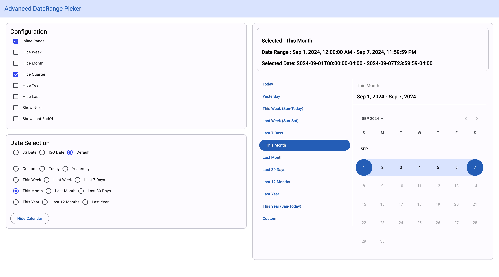
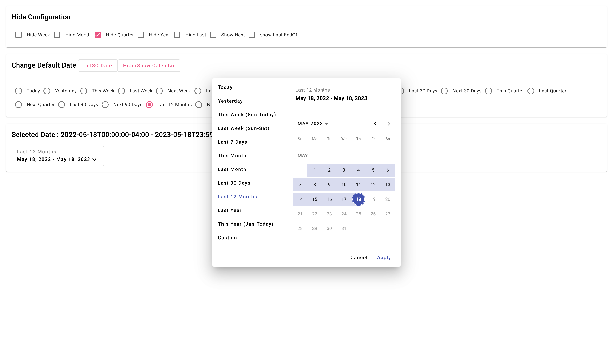

# NgxAdvancedDaterangepicker

`NgxAdvancedDaterangepicker` is an Angular date range picker component with advanced functionality and Material Design support. It allows for easy date range selection with customizable options and is simple to integrate into any Angular project.




## Features

- Select predefined date ranges (e.g., today, this week, etc.).
- Emits date selection events for further customization.
- Easily integrates with Angular Material.

## Installation

To install `NgxAdvancedDaterangepicker`, you can use either `npm` or `yarn`:

```bash
# Using npm
npm install ngx-advanced-daterangepicker

# Using yarn
yarn add ngx-advanced-daterangepicker
```

Additionally, install the required Angular Material and Luxon dependencies:

```bash
ng add @angular/material
npm install luxon @angular/material-luxon-adapter
```

## Usage

### Import the Module

In your `app.module.ts`, import the `NgxAdvancedDaterangepickerModule`:

```typescript
import { NgxAdvancedDaterangepickerModule } from 'ngx-advanced-daterangepicker';

@NgModule({
  declarations: [/* Your Components */],
  imports: [
    /* Other Modules */
    NgxAdvancedDaterangepickerModule
  ],
  bootstrap: [AppComponent]
})
export class AppModule { }
```

### Add Styles

Include the Angular Material theme in your global styles (e.g., `styles.scss`):

```scss
@import "@angular/material/prebuilt-themes/azure-blue.css";
```

### Add Component to Template

In your Angular component template, use the `ngx-advanced-daterangepicker` component:

```html
<ngx-advanced-daterangepicker
  [selectDays]="'today'"
  (on-change)="getDateSelection($event)"
></ngx-advanced-daterangepicker>
```

### Handling Date Selection

In your component `.ts` file, implement the `getDateSelection` method to handle date changes:

```typescript
export class MyComponent {
  getDateSelection(event: any) {
    console.log('Selected Date Range:', event);
    // Handle the selected date range here
  }
}
```

## Development

To build and serve the project locally, you can run the following commands:

```bash
# Build the library
ng build --watch ngx-advanced-daterangepicker

# Serve the demo application
ng serve ngx-custom-daterangepicker
```
